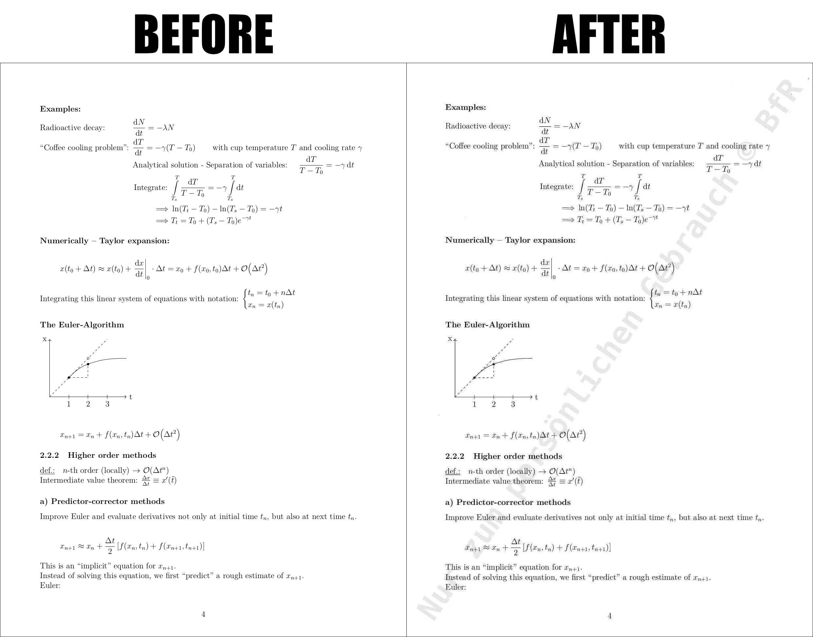

# BfRify

Have you ever thought that your PDF's quality per file size ratio was just way too high?

Well, the [Bundesamt für Risikobewertung](https://www.bfr.bund.de/en/home.html)
probably thought exactly the same when they published their [report about the risk of using Glyphosat](https://fragdenstaat.de/aktionen/zensurheberrecht-2019/).

With **BfRify**, you can now increase your PDF's footprint while simultaneously adding just the [right dose of jpeg](http://needsmorejpeg.com/) to it, and the cool watermark comes with it completely free of charge!

## Dependencies

Needs **`convert (imagemagick)`** and **`pdftk`** to work.

## Usage

```bash
./BfRify.sh <input pdf> <output pdf>
```

## Example

